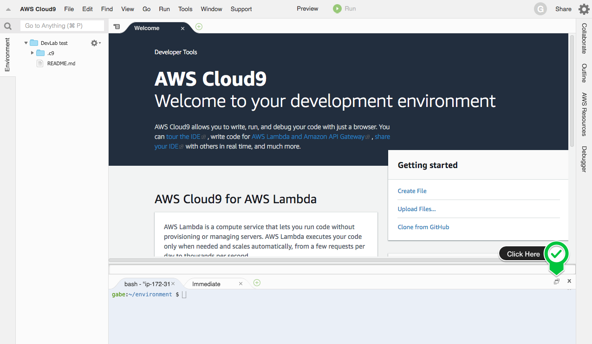

# Dev Lab: Working effectively with the AWS Command Line Interface (CLI)

This lab is provided as part of [Dev Day Online](https://github.com/aws-john/dev-day-labs).

ℹ️ You will run this lab in your own AWS account. Please follow directions at the end of the lab to remove resources to minimize costs.

The **AWS Command Line Interface (AWS CLI)** is an open source tool that enables you to interact with AWS services using commands in your command-line shell. With minimal configuration, you can start using functionality equivalent to that provided by the browser-based AWS Management Console from the command prompt in your favorite terminal program. And, in some cases, there are even some things you can do with the CLI that you can't do with the browser-based AWS console (see below for one such example)!

All IaaS (infrastructure as a service) AWS administration, management, and access functions in the AWS Management Console are available in the AWS API and CLI. New AWS IaaS features and services provide full AWS Management Console functionality through the API and CLI at launch or within 180 days of launch.

The AWS CLI provides direct access to the **public APIs of AWS services**. You can explore and interact with a service's capabilities with the AWS CLI, or develop shell scripts to manage your resources.

In addition to the low-level, API-equivalent commands, several AWS services provide customizations for the AWS CLI. Customizations can include **higher-level commands** that simplify using a service with a complex API. For example, the `aws s3` set of commands provide a familiar syntax for managing files in Amazon Simple Storage Service (Amazon S3).

## Setting Up a Lab Environment

To run this lab, you will require an AWS account. You will be using a Cloud9, which is a web-based development environment that provides a terminal program running on a virtual machine that has the AWS CLI pre-installed and configured.

**1.** Login to your AWS Account.

**2.** From the **Services** menu, select **Cloud9**.

If you are prompted for a region, select the one closest to you.

You will now create a Cloud9 environment.

**3.** Click **Create environment**.

**4.** For **Name**, enter: `cli-lab`

**5.** Click **Next step** twice, then click **Create environment**.

Cloud9 will take a few minutes to launch the environment. Once it is ready, continue to the next step.

**6.** Maximize the terminal window by clicking the icon as shown below:



## Part 1: AWS CLI Basics

### Getting Help

The AWS CLI includes built-in help. You can get help with any command when using the AWS CLI. To do so, simply type `help` at the end of a command name.

**7.** Enter this command in the terminal window:

```
aws help
```

It will display help for the general AWS CLI options and the available top-level commands.

**8.** Press `q` to exit the help page.

### The AWS CLI Command Structure

The AWS Command Line Interface (AWS CLI) uses a multipart structure on the command line that must be specified in this order:

`aws \[service\] \[command\] --parameters`

- The base call to the `aws` program
- The AWS service that is being called
- A command that matches an API call to the service
- Parameters that specify information (eg the ID of an instance)

Parameters can take various types of input values, such as numbers, strings, lists, maps, and JSON structures. Parameters vary depending upon the command specified.

## Working With Amazon S3 Buckets and Files

You will now explore commands that can manage files on Amazon S3.

**Amazon Simple Storage Service (Amazon S3)** is an object storage service that offers industry-leading scalability, data availability, security, and performance. Customers of all sizes and industries use it to store and protect any amount of data for a range of use cases, including websites and data backup/restore/archival scenarios.

Amazon S3 is so useful for storing and retrieving files that developers will often interact with it from the command line. In this section, you will create a new bucket, put some files in it by syncing a folder from the local filesystem, and list the files from the remote bucket.

### Create a new S3 Bucket

Whenever you store data in Amazon S3, you put it in a construct called a **bucket**. A bucket is just a namespace that groups data objects together at the root level, similar to how the files on your computer reside on your hard drive.

Amazon S3 Buckets must have **globally unique names**.

**9.** Run this command to generate a unique name:

```
export BUCKET_NAME="devlab-cli-bucket-$(uuidgen)"
echo $BUCKET_NAME
```

**10.** Run this command to make a bucket (`mb`):

```
aws s3 mb s3://$BUCKET_NAME
```

This line is sending a command to `s3`, using the `mb` (make bucket) command, passing in the bucket name as the argument for the command.

### Sync a local folder with the bucket

Amazon S3 includes a `sync` command that **syncs whole buckets or directories**. It recursively copies new and updated files from the source directory to the destination. This is a very fast way to upload or download files to S3. It can also be used to synchronize data between bukets.

You will now use the `sync` command to copy files to the Amazon S3 bucket you created. The Cloud 9 virtual machine has some basic website structure in `/var/www` that you will copy to the buket.

**11.** Run this command:

```
aws s3 sync /var/www s3://$BUCKET_NAME
```

**12.** Run this command to list the contents of the bucket:

```
aws s3 ls s3://$BUCKET_NAME
```

You will notice that there are several directories (or 'prefixes') listed.

**13.** Run this command to view the contents of the `icon` directory:

```
aws s3 ls s3://$BUCKET_NAME/icons/
```

A popular use for the `aw s3 sync` command is to publish a website built with a static site generator. Since [Amazon S3 is capable of hosting static websites](https://docs.aws.amazon.com/AmazonS3/latest/dev/WebsiteHosting.html) from a publicly accessible bucket, deploying new builds is as easy as running a build command in your local development workstation or CI build server and then running `aws s3 sync path/to/built/site s3://your-webite-s3-bucket`.

**14.** Run this command to delete the S3 bucket and its content:

```
aws s3 rb s3://$BUCKET_NAME --force
```

## Part 2: Filtering and Querying

The `--filter` and `--query` flags are powerful capabilities that can control the information returned by a CLI command.

### Filter the data server-side

Some (not all) AWS CLI commands support the `--filter` flag to limit the items returned from AWS. For example, `aws ec2 describe-images` will list all Amazon Machine Images (AMIs). It accepts a `--filter` argument to narrow down the list of results before AWS sends the data back to your computer.

**15.** Run this command, which includes a `--filter` argument:

```
aws ec2 describe-images --owners amazon --filters "Name=name,Values=Windows_Server-2019-English-Full-Base*"
```

The filter requested only the AMIs for Windows Server 2019, rather than returning a list of _all_ AMIs.

### Query the data client-side

The `describe-instances` call you just used returned many fields, but what if you only want one of those fields? The `--query` argument can be used to limit the fields that are returned by a command.

**16.** Run this command, which includes a `--query` argument:

```
aws ec2 describe-images --owners amazon --filters "Name=name,Values=Windows_Server-2019-English-Full-Base*" --query Images[*].[Name,ImageId]
```

This is saying: For each Image returned, only provide the Name of the image.

This query example is relatively simple, but you can perform very powerful queries and transforms using JMES Path expressions. Take a look at http://jmespath.org/examples.html for more inspiration on what you can achieve. Also, you may find the open source tool `jq` helpful for working with JSON results on the command line. See https://stedolan.github.io/jq/ to learn more.

### Use different Output styles

Sometimes it can be a lot easier to read the output from AWS CLI commands if you change the output format. In addition to the default JSON output, the AWS CLI can also output results in an ASCII tabular format or as tab-seperated lines of text.

**17.** Run this command, which includes an `--output` argument:

```
aws ec2 describe-images --owners amazon --filters "Name=name,Values=Windows_Server-2019-English-Full-Base*" --query Images[*].[Name,ImageId] --output text
```

It displays the results as text-only rather than in JSON format.

**18.** Run this command to view the results as a formatted table:

```
aws ec2 describe-images --owners amazon --filters "Name=name,Values=Windows_Server-2019-English-Full-Base*" --query Images[*].[Name,ImageId] --output table
```

The text output style from `--output text` is helpful for passing the results on to other UNIX commands.

**19.** Run this command to sort the output by date:

```
aws ec2 describe-images --owners amazon --filters "Name=name,Values=Windows_Server-2019-English-Full-Base*" --query Images[*].[Name,ImageId] --output text | cut -f 1 | sort
```

## Part 3: Putting it All Together

You will now take everything you have learned and put it together in one comprehensive example.

First, you will create an **IAM role** suitable for attaching to an Amazon EC2 instance. This is a common practice that lets you grant Amazon EC2 instances permissions for various API calls on AWS without having to manage credentials yourself on the instance.

**20.** Run this command (copy and paste all lines together):

```
aws iam create-role \
--role-name "Cloud9-devlab-ec2-role" \
--description "Allows EC2 instances to call AWS services with given permissions." \
--assume-role-policy-document \
'{"Version":"2012-10-17","Statement":[{"Effect":"Allow","Action":["sts:AssumeRole"],"Principal":{"Service":["ec2.amazonaws.com"]}}]}'

aws iam attach-role-policy \
--role-name "Cloud9-devlab-ec2-role" \
--policy-arn "arn:aws:iam::aws:policy/AmazonS3ReadOnlyAccess"
```

Now, you will try to delete the role. This will not work because you cannot delete a role that has policies attached to it.

**21.** Run this command:

```
aws iam delete-role --role-name Cloud9-devlab-ec2-role
```

Notice the error message:

> An error occurred (DeleteConflict) when calling the DeleteRole operation: Cannot delete entity, must detach all policies first.

To delete a role, you must first **detach all of the policies** from it. You could do this individually but instead you use the power of the CLI with a little shell scripting to automate the process.

You will use a shell script to find all roles that begin with `Cloud9-dev`, detach all the policies from them, and then delete the roles:

- First it will fetch the roles with `aws iam list-roles` and use a `--query` parameter to only find roles with names starting with `Cloud9-dev`
- Then, for each role, it will fetch the attached policies with `aws iam list-attached-role-policies` taking care to only return the policy ARN for each attachment
- It will then call `aws iam detach-role-policy` to detach the policy from the role
- Finally, it will use `aws iam delete-role` to delete the role

**22.** Run this command (copy and paste all lines together):

```
roles=$(aws iam list-roles --query 'Roles[?starts_with(RoleName, `Cloud9-devlab`)].RoleName' --output text)

for role in $roles; do
  policies=$(aws iam list-attached-role-policies --role-name=$role --query AttachedPolicies[*][PolicyArn] --output text)
  for policy in $policies; do
    aws iam detach-role-policy --policy-arn $policy --role-name $role
  done
  aws iam delete-role --role-name $role
done
```

And this time, your attempt succeeds, because you removed the attached policies first!

## Clean Up

Please follow these instructions to clean-up your account so that there will be no on-going charges for any services used.

**23.** Click the **Maximize** icon in the top-right corner (next to the X) to return to the Cloud9 window.

**24.** Click the **AWS Cloud9** menu in the top-left, then click **Go To Your Dashboard**.

**25.** Click on the **cli-lab** box, then click the **Delete** button.

You will need to enter **Delete** to delete the environment.

## Further Reading

Congratulations! You have taken your first steps towards becoming more familiar with the powerful AWS Command Line Interface. To continue your learning journey, you might enjoy the following resources:

- [The AWS CLI Documentation](https://docs.aws.amazon.com/cli/latest/userguide/cli-chap-welcome.html)
- [The JMES Path Site](http://jmespath.org/) (for querying JSON results with the AWS CLI)
